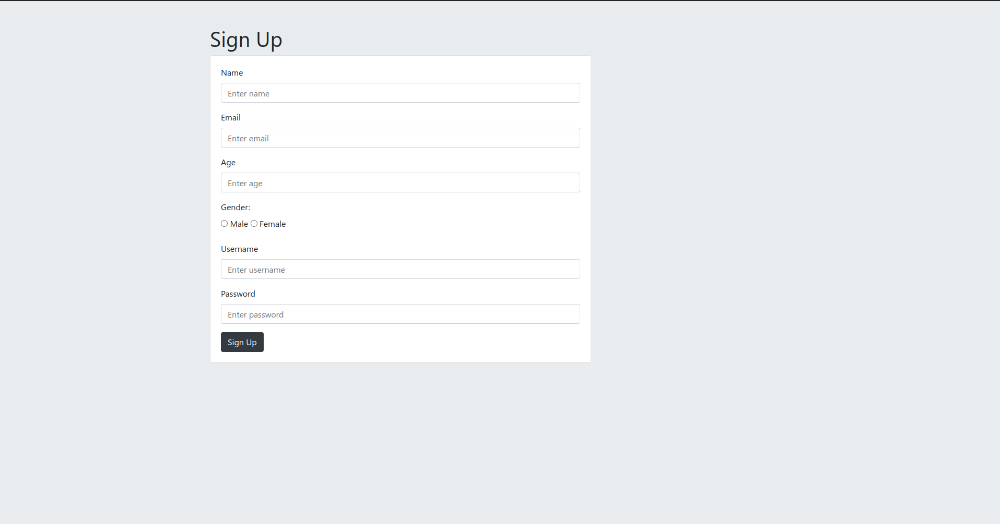
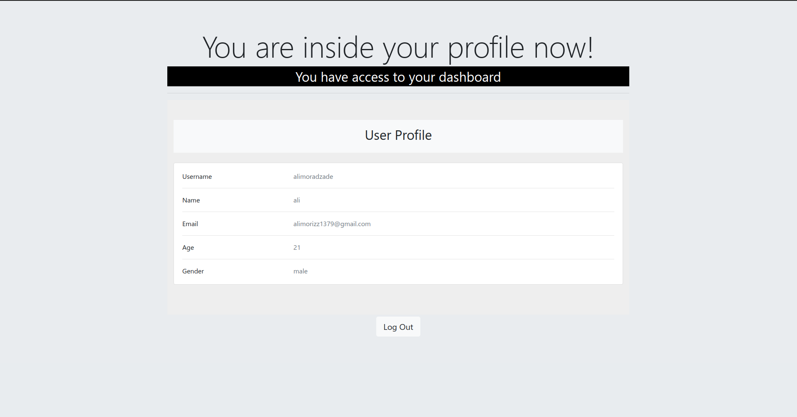
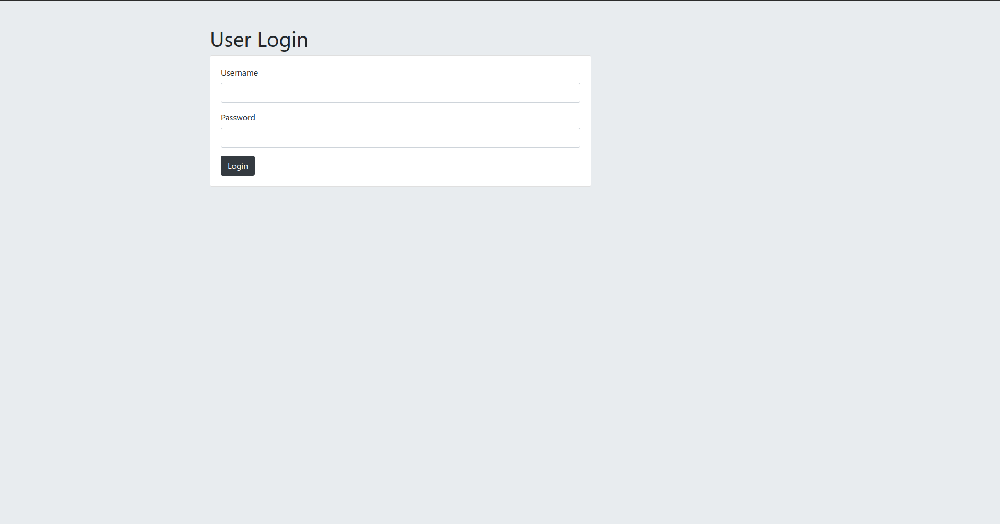

# internship-project

This repository contains three projects, one of them is created with node/express and other two are created by nest/typescript.

## Secret App
This app is built with node/express, it simulates a simple signup/login app, that you have a personal dashboard for yourself and just you can access it. It stores its data in a mongodb database and also uses a separate test database for the testing.


At first you go to the root route `/`, then you have two options, either login or signup.


### Sign Up
After you click the signup button, you are redirected to this page:



After that you fill the form, and then sign up. If your sign up was successfull, you are redirected to the secrets page, otherwise you will get an error.

In the secret page, you see your information, and the logout button, note that if you close the tab, you will be stay signed in, until you close the browser or click the log out button.



### Login
If you want to login, you click the login button, and you are redirected to login page:



Then you can enter your username and password, and if they were correct, access to your dashboard.

### Secrets
Note that when you try to access the secrets page, or your dashboard, without being logged in, you are redirected to the login page first. And also when you hit the logout button, you are redirected to the home page.

### Users API
There is also rest api for the users, they are as follows:

| Method   | URL                                      | Description                              |
| -------- | ---------------------------------------- | ---------------------------------------- |
| `GET`    | `/api`                                   | Gets a simple `{'hi':'there'}` respone   |
| `POST`   | `/api/users`                             | Creates a new user with the properties specified in the body |
| `GET`    | `/api/users/:id`                         | Gets a specific user with that id        |
| `PUT`    | `/api/users/:id`                         | Changes the properties of user with that id |
| `Delete` | `/api/users/:id`                         | Deletes the user with that id            |


### Tests
There is also test for each route, written with the `mocha` test frame work, and using package `request` for sending requests. 

## Expense App
This app is for managing reports, and also getting a summary of reports. This app is written using nest/typescript, it uses dtos to control the structure of messages recieved and throws away messages with bad format and returns suitable error.

For the report path we have:
| Method   | URL                                      | Description                                                                   |
| -------- | ---------------------------------------- | ----------------------------------------------------------------------------- |
| `GET`    | `/report/:reportType`                    | Gets reports with the specified reportType, that can be `income` or `expense` |
| `GET`    | `/report/:reportType/:id`                | Gets the specific report with that type                                       |
| `GET`    | `/report/:reportType/:id`                | Gets the specific report with that type                                       |
| `POST`   | `/report/:reportType/`                   | Creates the specified report, with that report type                           |
| `PUT`    | `/report/:reportType/:id`                | Changes attributes of report with that type and id                            |
| `DELETE` | `/report/:reportType/:id`                | Deletes report with that type and specified id                                |

Note: For simplicity this app just uses a simple array of reports, not database.

Our reports are in the following format:
```javascript
report: {
    id: string;
    source: string;
    amount: number;
    created_at: Date;
    updated_at: Date;
    type: ReportType;
}[];
```

And the default data for reports, contains:
```javascript
data: [
    {
        id: "2d256586-6931-4f67-a63f-16207acef5cc",
        source: 'Salary',
        amount: 7500,
        created_at: new Date(),
        updated_at: new Date(),
        type: ReportType.INCOME,
    },
    {
        id: "56e62afa-2250-49d4-8b74-ae0fd1ac83d6",
        source: 'Udemy',
        amount: 15000,
        created_at: new Date(),
        updated_at: new Date(),
        type: ReportType.INCOME,
    },
    {
        id: "8a188757-1d6e-4730-86bf-c9e2dd484680",
        source: 'Food',
        amount: 7500,
        created_at: new Date(),
        updated_at: new Date(),
        type: ReportType.EXPENSE,
    },
    {
        id: "04f80873-0b67-49ad-82f1-2b03d8d9cbfe",
        source: 'Clothes',
        amount: 7500,
        created_at: new Date(),
        updated_at: new Date(),
        type: ReportType.EXPENSE,
    },
]
```

There is also a summary path:
| Method   | URL                                      | Description                                                                   |
| -------- | ---------------------------------------- | ----------------------------------------------------------------------------- |
| `GET`    | `/summary`                               | Returns summary based on all reports, and thier types                         |

The response of the above api is as follows:
```javascript
{
    totalIncome,
    totalExpense,
    netIncome: totalIncome - totalExpense,
}
```
`totalIncome` is the total of amount of each income. The `totalExpense` is also the same for expenses.

## Realtor App
This is an app that simulates a realtor, it uses the nest interceptors and guards and implements authorization and authentication.